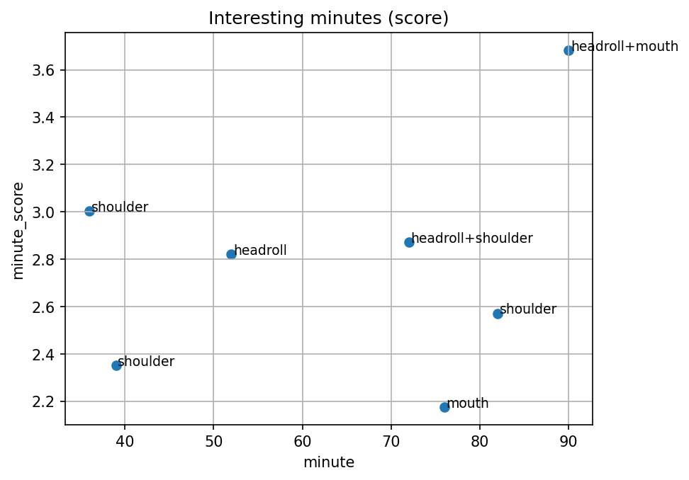

# ErgoVision AI

ErgoVision AI is a computer vision pipeline for analyzing long videos and detecting unusual posture and facial activity.

The project uses MediaPipe to extract body and face landmarks, converts them into interpretable features, aggregates the results by minute, detects unusual time intervals, and exports short video clips for review.

## Project Goal

The goal is to reduce the time needed to manually review long videos.

Instead of watching a full 90-minute recording, a specialist can inspect only the most unusual segments detected by the pipeline.

The project does not make medical diagnoses. It only provides measurements and highlights potentially interesting moments for further review.

## Features

The pipeline calculates three main features:

- shoulder height difference;
- head roll angle;
- mouth opening ratio.

The results are aggregated by minute and analyzed using z-scores.

Minutes with unusual values are ranked by anomaly score and converted into short video clips using FFmpeg.

## Pipeline

```text
video
  ↓
MediaPipe landmarks
  ↓
frame-level features
  ↓
minute-level aggregation
  ↓
z-score anomaly detection
  ↓
interesting segments
  ↓
video clips, timeline and report
```

## Example Results

For a 90-minute lecture video, the pipeline:

- processed approximately 27,000 sampled frames;
- generated 91 minute-level records;
- detected 7 unusual minutes;
- exported 7 ranked video clips;
- created a timeline visualization;
- generated a Markdown report.

## Project Structure

```text
ErgoVision-AI/
├── data/
│   ├── raw/
│   └── processed/
├── src/
│   ├── config.py
│   ├── run_pipeline.py
│   └── step*.py
├── requirements.txt
├── .gitignore
└── README.md
```

## Technologies

- Python
- MediaPipe
- OpenCV
- Pandas
- Matplotlib
- FFmpeg

## Installation

Create a virtual environment:

```bash
python -m venv venv
```

Activate it on Windows:

```bash
venv\Scripts\activate
```

Install dependencies:

```bash
pip install -r requirements.txt
```

FFmpeg must be installed separately.

## Running the Pipeline

Run the post-processing pipeline:

```bash
python src/run_pipeline.py
```

The pipeline creates:

- [interesting_minutes.csv](data/processed/interesting_minutes.csv);
- [interesting_segments.csv](data/processed/interesting_segments.csv);
- ranked video clips;
- [timeline_interesting.png](data/processed/timeline_interesting.png);
- [report.md](data/processed/report.md).

## Timeline Preview



## Limitations

- The project currently analyzes one person in a mostly static lecture video.
- Landmark quality depends on lighting, camera angle, and visibility.
- The anomaly score shows deviation from the video average, not a medical problem.
- FFmpeg configuration may require a local system path.

## Future Improvements

- full end-to-end pipeline execution;
- configurable feature selection;
- additional posture and movement features;
- improved segment grouping;
- support for multiple videos;
- interactive dashboard.
